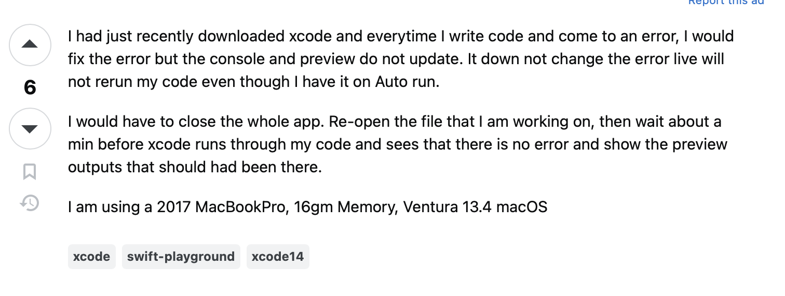

## Question asked the "smart" way

<a href="https://stackoverflow.com/questions/57708099/how-to-get-previews-working-again-in-a-swiftui-project">smart question</a> 

This question is asked the "smart" way since the asker is being detailed with the issue. They are clearly struggling with loading up a preview on Xcode, and provide the diagnostics message as well. They even detail how they tried testing the code to see what could possibly be going wrong, and describe their current idea of a solution to the problem.

## Question asked not the "smart" way

<a href="https://stackoverflow.com/questions/76434049/xcode-preview-and-console-too-slow-or-not-working">'not smart' question</a> 

This question isn't asked in the context of "smart," as it seems to be describing the situation without imagery or direct context. It would help if there was more visual information so potential stackoverflowers could answer the question as best as they could. It's not the worst question, just a bit harder to follow than the previous one.

## So what?
Smart questions are easier to comprehend so those you are asking help from can assist you the best they can. If you detail out your problem with visuals and errors outputs/test code, then it will be a lot easier to troubleshoot. However, without a detailed way of depicting your issue, it is difficult to pinpoint the specific problem.