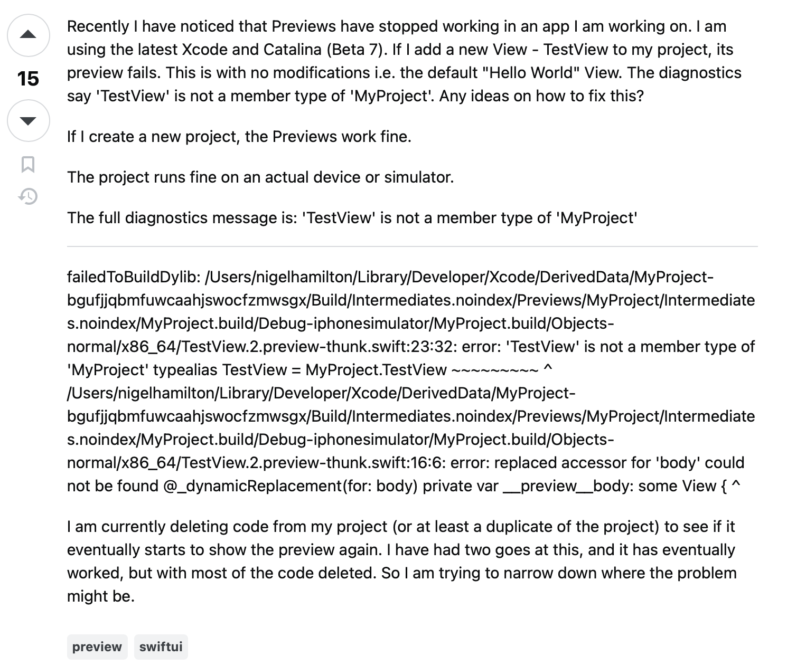

## Question asked the "smart" way

This question is asked the "smart" way since the asker is being detailed with the issue. They are clearly struggling with loading up a preview on Xcode, and provide the diagnostics message as well. They even detail how they tried testing the code to see what could possibly be going wrong, and describe their current idea of a solution to the problem.

## Question asked not the "smart" way

This question isn't asked in the context of "smart," as it seems to be describing the situation without imagery or direct context. It would help if there was more visual information so potential stackoverflowers could answer the question as best as they could. It's not the worst question, just a bit harder to follow than the previous one.