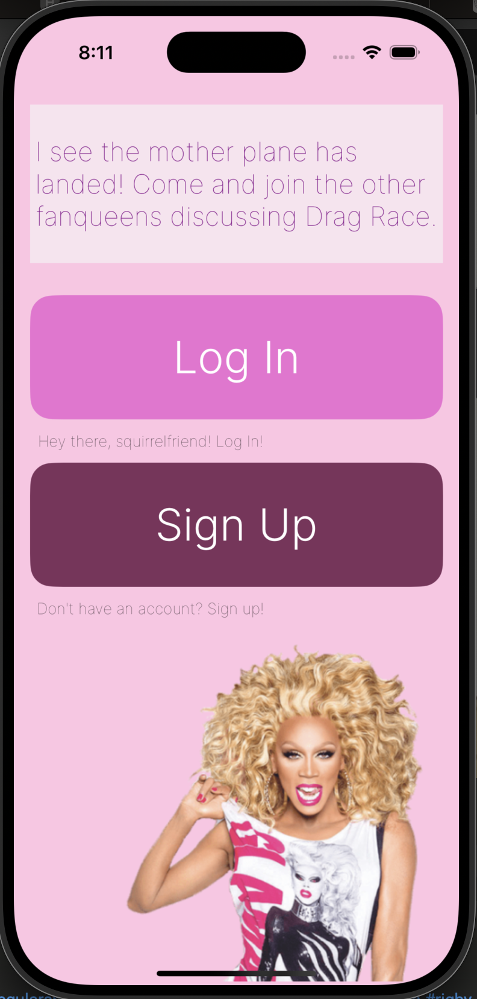
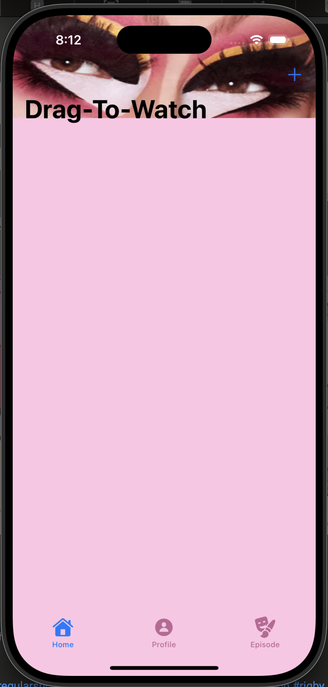
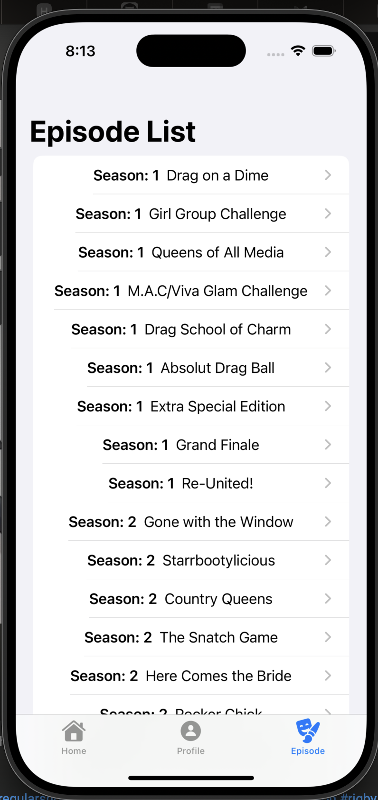
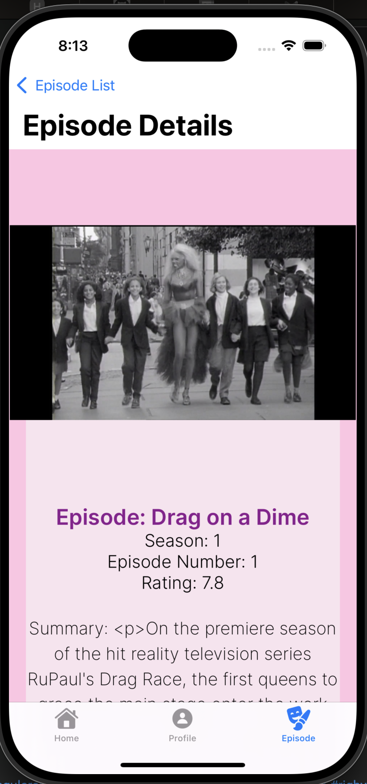

<figure class="text-center">
  <figcaption>Sign Up + Sign In</figcaption>
  
</figure>

<figure class="text-center">
  <figcaption>Sign Up</figcaption>
  
</figure>

<figure class="text-center">
  <figcaption>To-Watch List</figcaption>
  
</figure>

<figure class="text-center">
  <figcaption>Episode List</figcaption>
  
</figure>

<figure class="text-center">
  <figcaption>Episode View</figcaption>
  
</figure>

