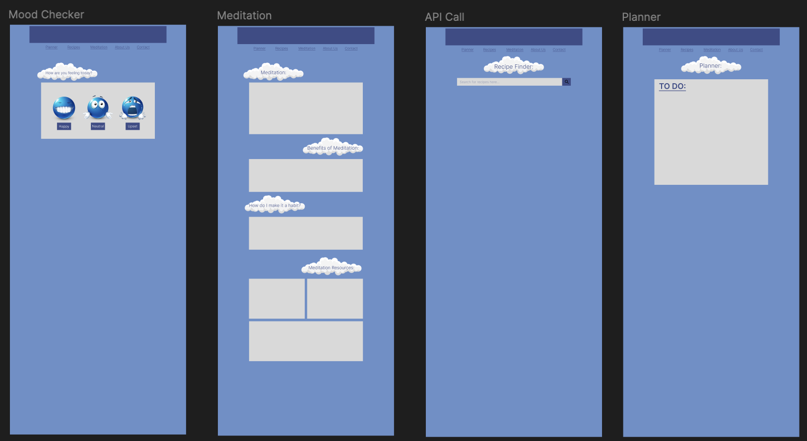

<figure class="text-center">
  <figcaption>Tranquil Demo</figcaption>
  <video class="img-fluid w-50" controls autoplay loop muted>
    <source src="../img/TranquilUI/WALKTHRU.mp4" type="video/mp4">
    Your browser does not support the video tag.
  </video>
</figure>

### **Figma Designs**

<figure class="text-center">
  <figcaption>Home</figcaption>
  
</figure>

<figure class="text-center">
  <figcaption>About + Contact</figcaption>
  
</figure>

<figure class="text-center">
  <figcaption>Activities</figcaption>
  
</figure>

<figure class="text-center">
  <figcaption>Resources</figcaption>
  
</figure>

 
Try it out: <a href="https://devpost.com/software/catbell">tranquil</a> 
Side note: the link will only work if you're on chrome!
