The health app, In2EAT, was created and concepted by Drs. Korpusik, Yazdansepas, and Almstedt. With the help of 5 undergraduates including myself, we were able to design, develop, and fully launch In2Eat into the app store. The process behind creating this app taught me a lot of skills ... especially with full-stack development. 

Myself, along with 2 other undergraduates, were in charge of designing the application screens and sequences from scratch. So, together, we worked on Figma to do so, giving and receiving feedback based on our designs. I was put in charge of designing the dashboard and recipe book pages. At this point, I have probably seen Xcode and Swift more often than my mom this past year. My newfound familiarity with the programming will carry me a long way, as working on Xcode has challenged me to not only develop the app's interface, but to also work on backend programming as well.

Show and tell! Here are screenshots of the sequences I created in the app. 

### **Figma Designs**

<figure class="text-center">
  <figcaption>Dashboard (Figma Design)</figcaption>
  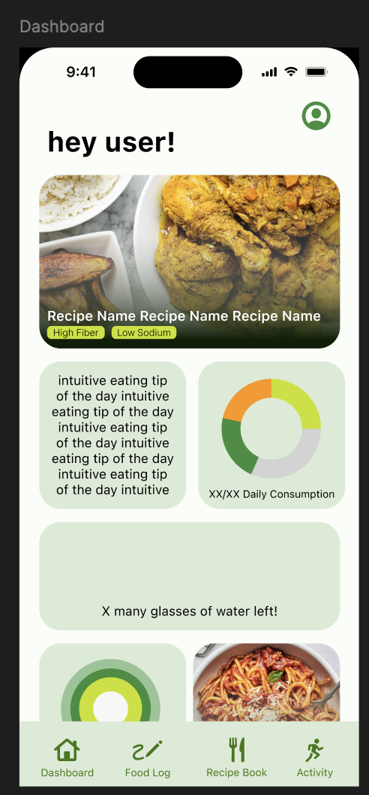
</figure>

<figure class="text-center">
  <figcaption>Recipe Book (Figma Design)</figcaption>
  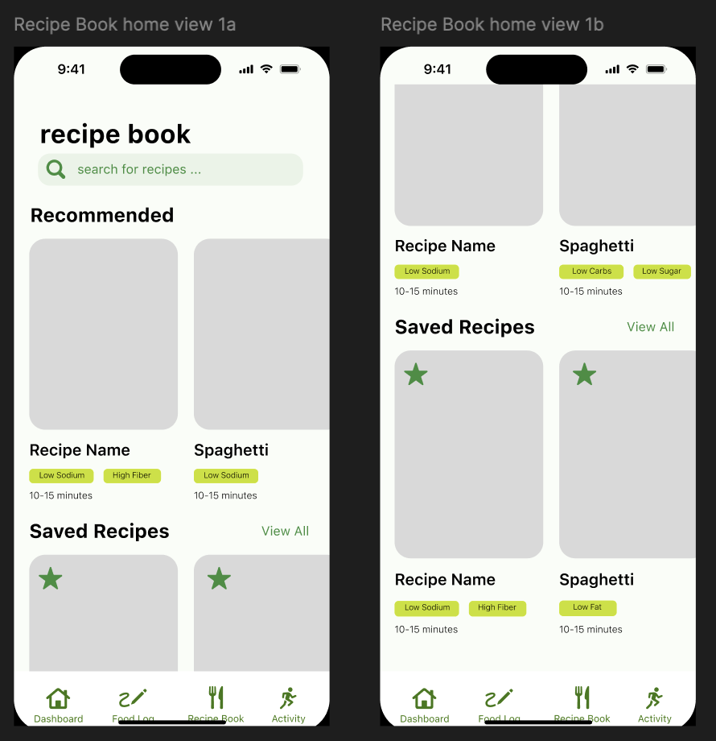
</figure>

<figure class="text-center">
  <figcaption>Recipe Book Search (Figma Design)</figcaption>
  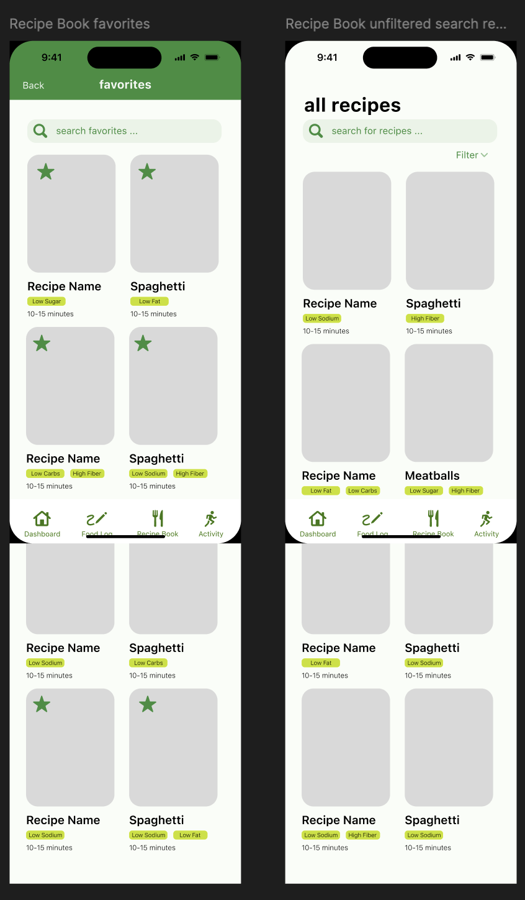
</figure>

<figure class="text-center">
  <figcaption>Recipe Filtering (Figma Design)</figcaption>
  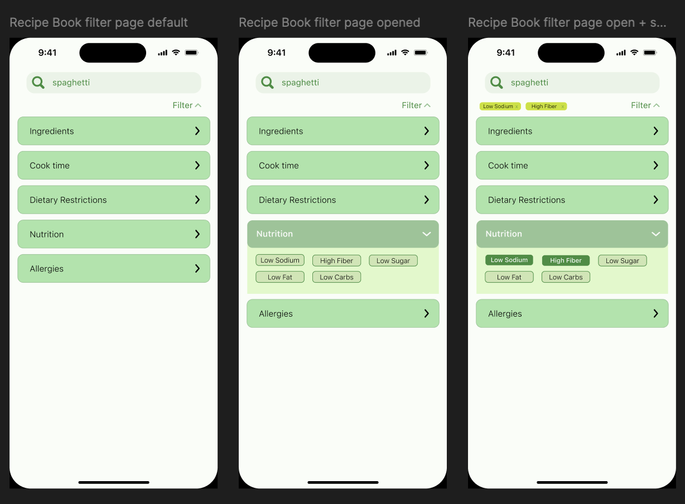
</figure>

<figure class="text-center">
  <figcaption>Recipe Search Detail (Figma Design)</figcaption>
  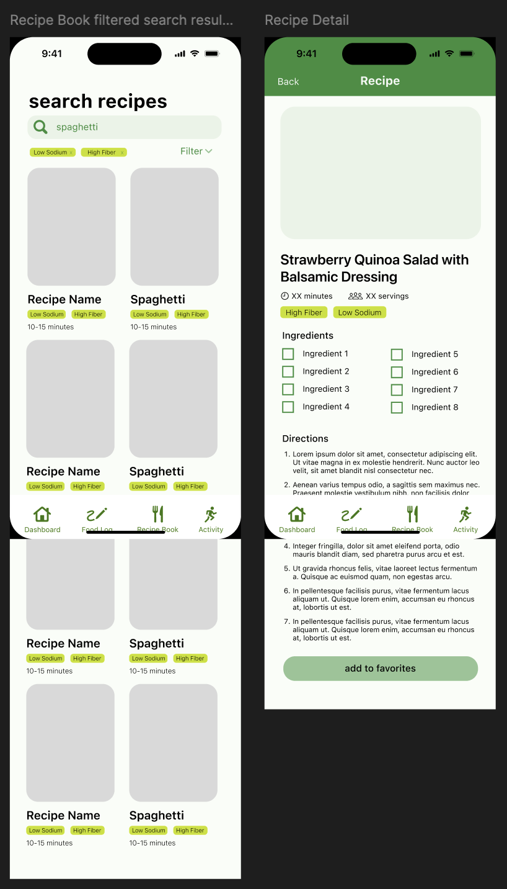
</figure>

---

### **Coded Screens in Xcode**

<figure class="text-center">
  <figcaption>Dashboard (Coded in Xcode)</figcaption>
  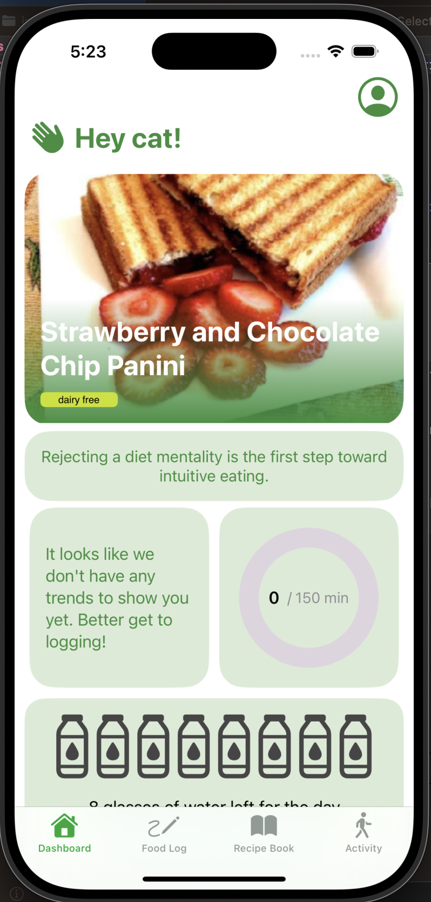
</figure>

<figure class="text-center">
  <figcaption>Dashboard Bottom Section (Coded in Xcode)</figcaption>
  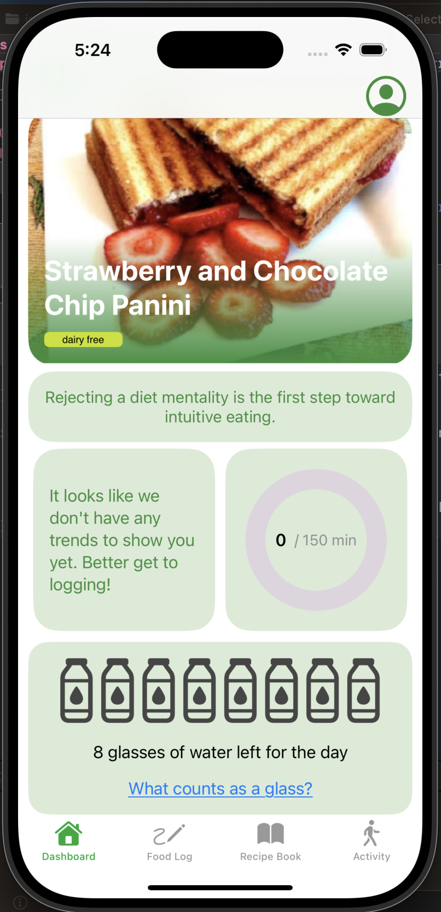
</figure>

<figure class="text-center">
  <figcaption>Dashboard Pie Chart (Coded in Xcode)</figcaption>
  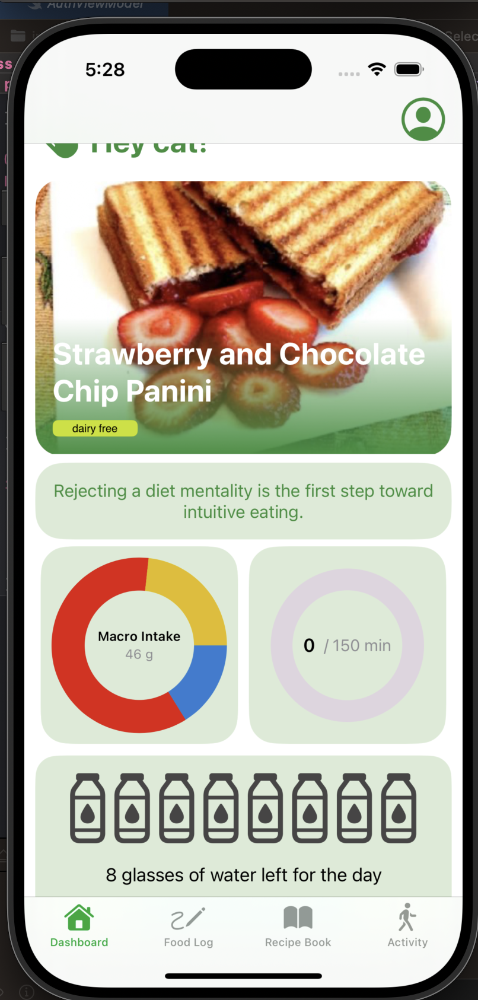
</figure>

<figure class="text-center">
  <figcaption>Recipe Home Page (Coded in Xcode)</figcaption>
  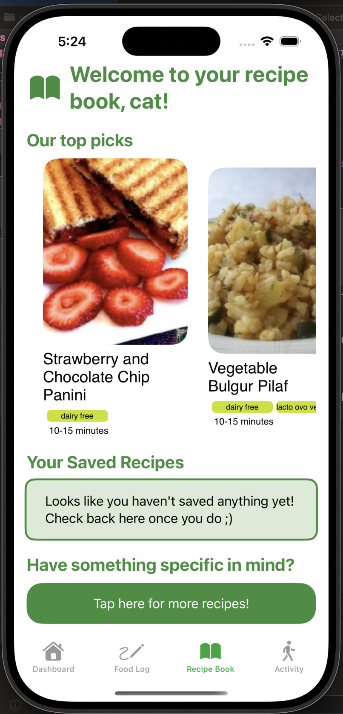
</figure>

<figure class="text-center">
  <figcaption>Recipe Detail Top (Coded in Xcode)</figcaption>
  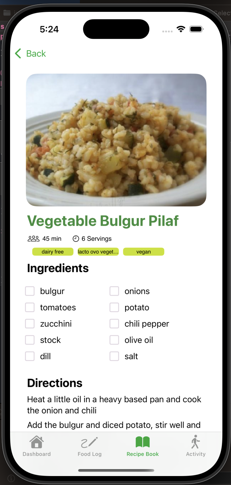
</figure>

<figure class="text-center">
  <figcaption>Recipe Detail Bottom (Coded in Xcode)</figcaption>
  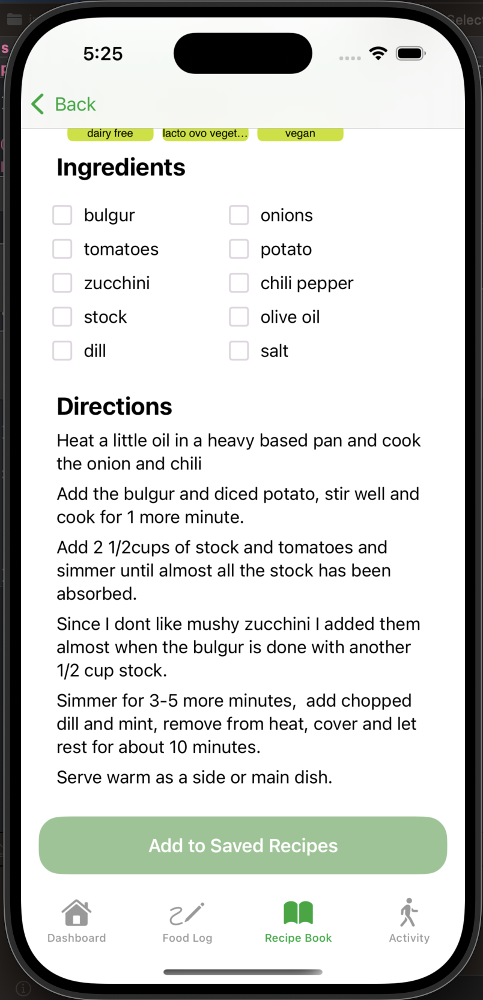
</figure>

<figure class="text-center">
  <figcaption>Recipe Search (Coded in Xcode)</figcaption>
  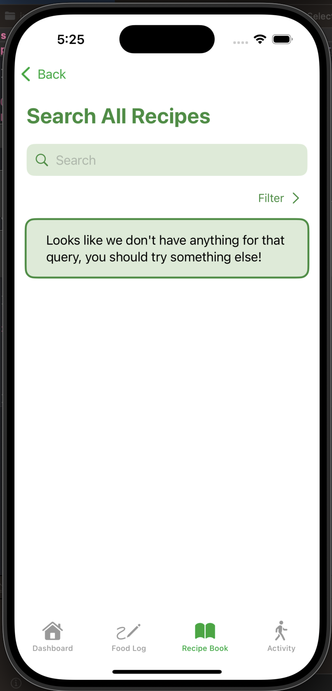
</figure>

<figure class="text-center">
  <figcaption>Recipe Search - Curry Example (Coded in Xcode)</figcaption>
  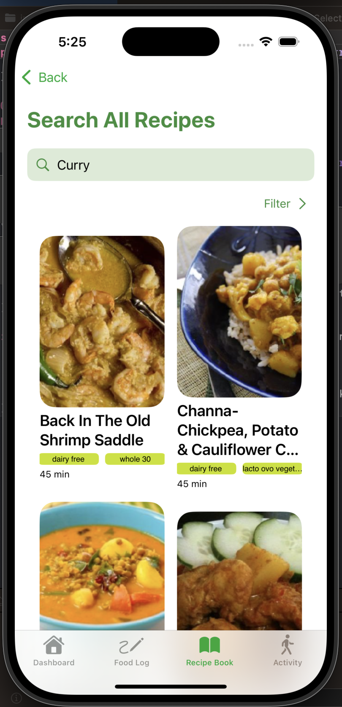
</figure>

<figure class="text-center">
  <figcaption>Recipe Filtering Expanded (Coded in Xcode)</figcaption>
  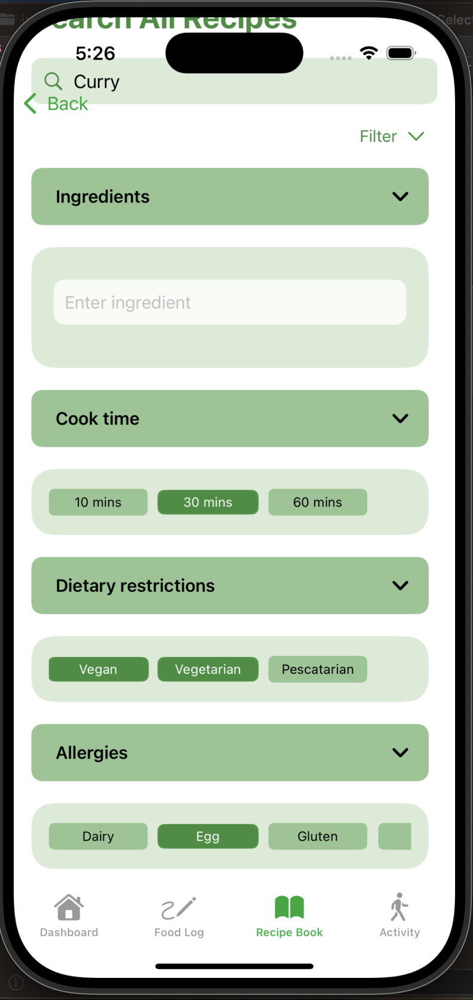
</figure>

<figure class="text-center">
  <figcaption>Recipe Filtering View (Coded in Xcode)</figcaption>
  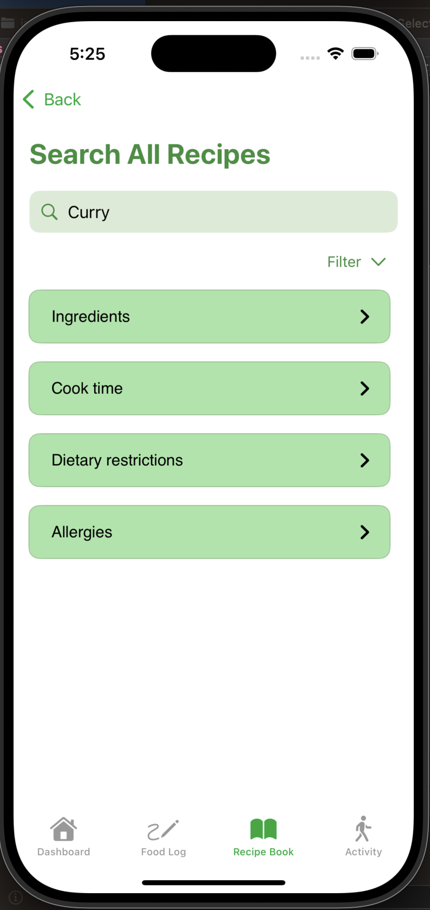
</figure>

---

### **Source Code**
<a href="https://github.com/cat-mb/intuEAT"><i class="large github icon "></i>cat-mb/in2eat</a>
